<!-- ╔══════════════════════════════════════════════════════════════╗ -->
<!-- ║                        HEADER / HERO                         ║ -->
<!-- ╚══════════════════════════════════════════════════════════════╝ -->

<div align="center">


<a href="https://github.com/MoRa2297">
  
</a>

<br/>

<!-- Live badges -->
<a href="https://www.linkedin.com/in/manuel-morandin-developer/"></a>
<a href="https://www.instagram.com/mora2297/"></a>
<a href="mailto:manuel.morandin@gmail.com"></a>
<a href="https://moracodes.dev/"></a>


</div>

<br/>

<!-- ╔══════════════════════════════════════════════════════════════╗ -->
<!-- ║                          ABOUT ME                            ║ -->
<!-- ╚══════════════════════════════════════════════════════════════╝ -->

## 🧭 About Me

```typescript
const manuel: Developer = {
  role: "Senior Full-Stack Engineer",
  location: "Melbourne, VIC 🇦🇺 (originally from Italy 🇮🇹)",
  currentlyAt: "Yolo Group — global iGaming leader",
  yearsOfExperience: 8,

  stack: {
    languages:  ["TypeScript", "JavaScript", "Python"],
    frontend:   ["React", "Next.js", "React Native", "TanStack", "Tailwind"],
    backend:    ["Node.js", "NestJS", "Express", "Prisma", "GraphQL"],
    realtime:   ["WebSockets", "SignalR"],
    cloud:      ["AWS", "Docker", "GitLab CI/CD", "GitHub Actions"],
    ai:         ["Claude Code", "MCP servers", "LangChain", "PyTorch", "scikit-learn", "RAG pipelines"],
  },

  currentlyBuilding: [
    "🏦 Open-source personal finance ecosystem (NestJS + Next.js + Prisma)",
    "💪 Gym SaaS product — fully agentic AI development",
    "🎓 AI Engineering program (ML, DL, MLOps, production AI)",
  ],

  passions: ["Clean architecture", "Design systems", "Drones 🚁", "Espresso ☕"],
};
```

<br/>

<!-- ╔══════════════════════════════════════════════════════════════╗ -->
<!-- ║                      DRONE SECTION 🚁                        ║ -->
<!-- ╚══════════════════════════════════════════════════════════════╝ -->

## 🚁 Off the Keyboard — Into the Sky

When I close the laptop, I pick up the controller. Drones are my other love: the precision,
the planning, the perfect frame caught at 120 meters. Same dopamine as shipping clean code,
just with propellers.

<div align="center">



</div>

<br/>

<!-- ╔══════════════════════════════════════════════════════════════╗ -->
<!-- ║                          TECH STACK                          ║ -->
<!-- ╚══════════════════════════════════════════════════════════════╝ -->

## 🧰 Tech Stack

<div align="center">

**Languages**


**Frontend**


**Backend & Real-time**


**DevOps & Cloud**


**AI-Assisted Development**


</div>

<br/>

<!-- ╔══════════════════════════════════════════════════════════════╗ -->
<!-- ║                       GITHUB STATS                           ║ -->
<!-- ╚══════════════════════════════════════════════════════════════╝ -->

## 📊 GitHub Battle Station

<div align="center">


<br/>


<br/>
<br/>


<br/>
<br/>


<br/>

<!-- Snake animation (requires a GitHub Action in your profile repo) -->


</div>

<br/>

<!-- ╔══════════════════════════════════════════════════════════════╗ -->
<!-- ║                      CURRENT PROJECTS                        ║ -->
<!-- ╚══════════════════════════════════════════════════════════════╝ -->

## 🔭 What I'm Building Right Now

> 🏦 **Personal Finance Ecosystem** — open-source. NestJS + Next.js + Prisma monorepo. Full budgeting, tracking, and automation, modelled around how *I* actually manage money.
>
> 💪 **Gym SaaS** — developed end-to-end with **fully agentic AI workflows**. Testing how far a solo engineer + Claude Code can go on a real product.
>
> 🎓 **AI Engineering Program** — Machine Learning, Deep Learning, Computer Vision, NLP, PyTorch, MLOps & production AI systems.

<br/>

<!-- ╔══════════════════════════════════════════════════════════════╗ -->
<!-- ║                         CONTACT                              ║ -->
<!-- ╚══════════════════════════════════════════════════════════════╝ -->

## 📡 Let's Connect

I'm always up for a chat about **distributed systems**, **AI-assisted engineering**, **design systems**, **drones**, or a proper espresso in Melbourne.

<div align="center">

[](mailto:manuel.morandin@gmail.com)
[](https://www.linkedin.com/in/manuel-morandin-developer/)
[](https://www.instagram.com/mora2297/)
[](https://moracodes.dev/)

</div>

<br/>

<div align="center">


</div>
